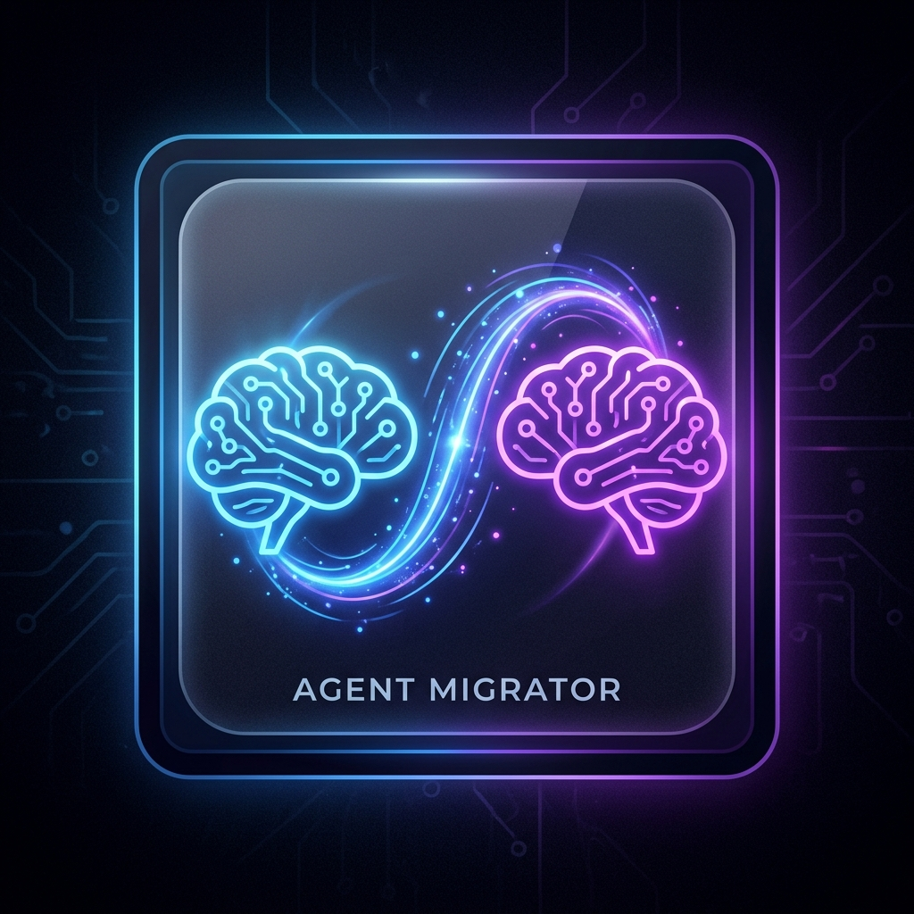
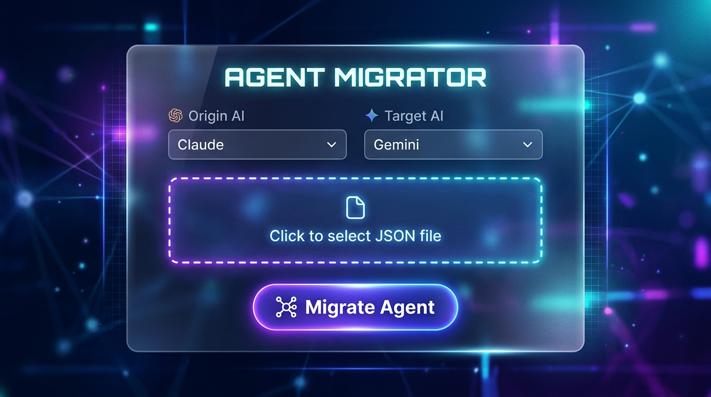

# Agent Migrator ✨

  

**Transfer context and memory between AIs like magic.**

Agent Migrator is a powerful, sleek Visual Studio Code extension that allows you to seamlessly migrate AI Agent configurations and memories between different LLM ecosystems without losing any context.

---

## 📸 See it in action

  

## ✨ Key Features & Capabilities

Agent Migrator is built to bridge the gap between different LLM agent formats. Whether you are using Anthropic, Google, or GitHub ecosystems, you can move your agents effortlessly.

### 🧠 1. Universal Context Translation
* **Cross-Ecosystem Parity:** Translate seamlessly between **Claude**, **Gemini**, and **Copilot** configuration formats.
* **Intelligent Metadata Mapping:** The extension doesn't just copy text; it understands custom JSON keys (`role`, `description`, `tone_and_style`, `review_examples`) and intelligently injects them into the official System Prompt schemas of your target AI.
* **Lossless History Transfer:** Your agent's memory (chat history and `messages` arrays) is flawlessly converted from one provider's role format (e.g., `assistant`) to another's (e.g., `model`).

### ⚙️ 2. Purist JSON Generation
* **Zero Garbage Fields:** Generates beautiful, production-ready JSON payloads. If your origin file doesn't have a specific setting (like `temperature` or `messages`), the generator is smart enough to omit it rather than generating empty objects (like `generationConfig: {}`).
* **API-Compliant:** Outputs strict schemas that can be directly uploaded to Google AI Studio, Vertex AI, Anthropic Console, or GitHub Copilot configurations without throwing validation errors.

### 🎨 3. "WOW" User Interface Experience
* **Premium Glassmorphism Design:** A breathtaking Webview UI featuring animated dark gradients, floating neon particles, and premium blur effects.
* **Frictionless UX:** Simple dropdowns, a glowing upload zone, and instant visual feedback when your file is parsed and ready to migrate.

### 🛡️ 4. Enterprise-Grade Security
* **Strict CSP Implementation:** The internal Webview employs precise Content Security Policies (CSP) to completely mitigate Cross-Site Scripting (XSS) risks.
* **Anti-Crash Protection (DoS):** Includes file-size validators that block excessively large JSON payloads (max 5MB) from freezing or exhausting your VS Code memory.

## 🛠 Usage

1. Open the Command Palette (`Cmd+Shift+P` on Mac, `Ctrl+Shift+P` on Windows).
2. Type **`AgentMigrator: Migrate AI Agent`** and press Enter.
3. Select your **Origin AI** and **Target AI**.
4. Upload your agent's JSON configuration file.
5. Click **Migrate Agent 🚀** and choose where to save the converted file!

## ⚙️ Supported Platforms
- **Anthropic Claude**
- **Google Gemini**
- **GitHub Copilot**

---
*Built with ❤️ for AI Engineers.*
